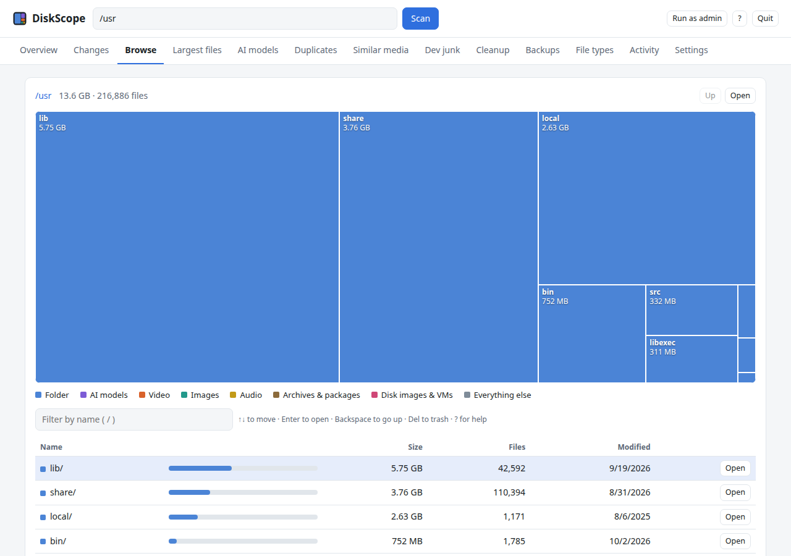
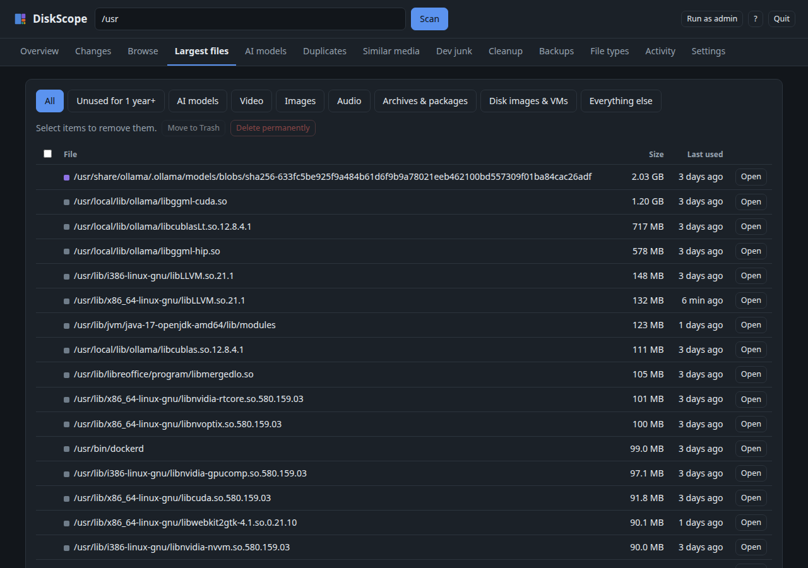

# DiskScope

**One app to find out what's eating your disk, and fix it.** DiskScope replaces a folder-size tool, a duplicate finder, a similar-photo finder, a cache cleaner and a backup-size checker with a single window. It also tells you **what changed since last time**, and it can warn you before a drive fills up.

Each drive's last scan is saved, so DiskScope **opens instantly** with your previous results ("Scanned 9 days ago"). Press **Rescan** whenever you want fresh numbers.

It's a single Python file that uses only the standard library. Nothing leaves your machine.



## Install

```bash
curl -fsSL https://raw.githubusercontent.com/0Beemik/DiskScope/main/install.sh | bash
```

This installs for your user only (no root needed), adds a `diskscope` command, and puts **DiskScope** in your app menu.

**Requirements:** Linux and Python 3.8+.

**Optional extras:**
- `ffmpeg` (similar photos/videos)
- Google Chrome, Chromium, Brave or Edge (DiskScope opens as its own app window; otherwise it uses a browser tab)
- `notify-send` (low-space alerts)

Uninstall (also removes the alert timer and saved history):

```bash
curl -fsSL https://raw.githubusercontent.com/0Beemik/DiskScope/main/install.sh | bash -s -- --uninstall
```

## What it does

| Tab | |
|---|---|
| **Overview** | Every drive at a glance, with when each was last scanned (click one to open its saved scan). A bar showing where every byte of a drive goes, including space **only admins can read** and space **reserved by the filesystem**, the two usual reasons for "missing" space. A ranked list of **ways to free space** with one click to each. |
| **Changes** | Each scan is saved, so you see **what grew and what shrank** since any earlier scan: folders, new big files, and files that are gone. Folders are collapsed to the one that actually changed. |
| **Browse** | Clickable treemap and sorted list. Filter by name, and drive it all from the keyboard. |
| **Largest files** | Filter by kind (AI models, video, images, disk images, archives) or **"unused for over a year"**. |
| **AI models** | Every model on the machine, grouped by app (Hugging Face cache, Ollama, ComfyUI, LM Studio, llama.cpp…), with format, quantization, size and last use. Flags **the same model stored in two apps**. |
| **Duplicates** | Identical files over 1 MB (size → quick fingerprint → full BLAKE2 hash). **Merge** turns extra copies into hard links: every path keeps working, but the file is stored once. Or trash the copies. |
| **Similar media** | Near-duplicate photos and videos: burst shots, resized or re-exported copies. Shown as thumbnails, with the largest suggested as the keeper. |
| **Dev junk** | `node_modules`, virtualenvs, Rust `target/`, Gradle/CMake `build/`, `.next`… with when each project was last touched. |
| **Cleanup** | uv / pip / npm / Yarn / Cargo / Gradle / Playwright caches, Trash, thumbnails, Ollama, LM Studio, Android emulators, Steam, journal logs, apt, Docker, Flatpak, Snap. Safe caches have a one-click **Empty**; system items show the exact command. |
| **Backups** | Timeshift snapshots with **how much each one frees if deleted**, your schedule and filters, and which folders bloat your backups most (with a one-click copy of the filter to exclude them). |
| **File types** | Space per extension. |
| **Activity** | Everything DiskScope removed or changed. **Restore** trashed items and **undo** merges. |
| **Settings** | Hourly **low-space alerts**: a desktop notification when a drive drops below a threshold or fills up fast. |



## Usage

```bash
diskscope                 # open the system drive (its saved scan, or scan it the first time)
diskscope --rescan        # scan now instead of opening the saved scan
diskscope /mnt/data       # scan another drive or folder (or click a drive on the Overview)
diskscope --tab           # use a normal browser tab instead of an app window
diskscope --check         # one-off low-space check (what the alert timer runs)
diskscope --enable-alerts # or toggle alerts in Settings
diskscope --help
```

**Admin mode:** Folders like `/timeshift`, `/var/lib/docker` and system logs are only readable by root. Click **Run as admin** in the app (you'll get the system password dialog), right-click DiskScope in the app menu, or run `sudo diskscope`.

Closing the window stops DiskScope. Press <kbd>?</kbd> for keyboard shortcuts.

## Safety

- Every removal asks first. **Move to Trash** is the default and can be restored from the Activity tab. Permanent delete is a separate button.
- It refuses to touch system locations (`/usr`, `/etc`, `/boot`, `/timeshift`, your home folder itself, …). The UI doesn't even offer it.
- **Merging duplicates** re-checks each file's size and modification time first, and works atomically: a temporary link is renamed over the copy. Use it for files that don't get edited (models, installers, media), because editing one linked copy changes all of them. Undo is in the Activity tab.
- Duplicate and photo checks **don't change files' "last used" time**, so the "unused for a year" lists stay honest.
- Scans stay on one filesystem and count hard links once. Sizes are real disk usage, not apparent size.

## Privacy

The UI is served on `127.0.0.1` only. It needs a random per-session token and rejects requests whose `Host` isn't localhost, which blocks other websites from talking to it. Saved data lives in `~/.cache/diskscope` (saved scans, readable only by you; scan history; activity log; photo fingerprints) and `~/.config/diskscope` (settings).

## Development

```bash
python3 -m unittest discover -s tests -v
```

The tests use temporary folders only. CI runs them on Python 3.8 and 3.13, and also lints and round-trips the installer.

## License

MIT
